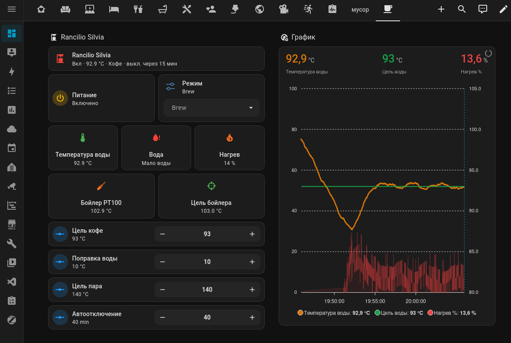

# Rancilio Silvia PID ESPHome

[Русская версия](README.ru.md)

[Telegram discussion group](https://t.me/Rancilio_Silvia) (Russian and English)

An ESP32-S3, ESPHome, and Home Assistant modernization project for the Rancilio Silvia espresso machine.

The project controls machine power, boiler heating, brew shot, hot water, and steam mode. It measures boiler temperature with a PT100 and MAX31865, provides separate PID modes for brewing and steaming, and exposes the machine to Home Assistant.

> [!WARNING]
> The espresso machine contains hazardous mains voltage and a hot pressurized boiler. ESPHome is not a replacement for the original thermostat, thermal fuse, protective earth, or any other hardware safety device. Never work on the machine while it is connected to mains power.



https://github.com/user-attachments/assets/92bf4580-1ab9-4535-a1f1-395bb5a3d315


## Features

- ESP32-S3 using ESP-IDF
- ESPHome and Home Assistant integration
- three-wire PT100 through MAX31865
- PID heater control through an SSR
- `Brew` and `Steam` modes
- adjustable target temperatures
- configurable brew-temperature offset applied to PID control
- PID parameter controls and autotune from Home Assistant
- automatic saving of successful autotune coefficients
- original power button support
- physical low-voltage inputs for brew shot, hot water, and steam mode
- Home Assistant controls for brew shot, hot water, steam mode, pump relay, and brew-valve relay
- timed brew shot control
- brew profiles: `Classic`, `Soft Preinfusion`, `Long Preinfusion`, and `Custom`
- configurable preinfusion pump time, preinfusion pause, and shot duration
- manual pump and brew-valve relay control
- inactivity-based automatic shutdown timer
- auto-off timer reset on brew shot, hot water, steam mode, and manual pump/valve activity
- status LED
- water-level sensor input
- configurable software overtemperature guard
- SSR lockout when the PT100 reading is invalid

## Repository layout

```text
.
├── README.md
├── README.ru.md
├── esphome/
│   ├── rancilio-silvia-power.yaml
│   └── secrets.example.yaml
├── docs/
│   ├── home-assistant.md
│   ├── safety.md
│   └── wiring.md
└── images/
```

## Quick start

1. Install ESPHome or the ESPHome Device Builder add-on in Home Assistant.
2. Copy `esphome/rancilio-silvia-power.yaml` into the ESPHome configuration directory.
3. Create `secrets.yaml` using `esphome/secrets.example.yaml`.
4. Verify every GPIO assignment and the electrical design for your exact board.
5. Validate the configuration before compiling the firmware.
6. Keep the machine under constant supervision during the first heater test.

## Configuration

The brew temperature, steam temperature, brew profile, preinfusion timings, shot duration, and automatic shutdown time are adjustable from Home Assistant. Values stored in the YAML file are initial defaults, not fixed machine specifications.

### Brew shot and profiles

`Silvia Brew Shot` starts an automated shot sequence:

1. open the brew valve;
2. optionally run the pump for preinfusion;
3. optionally pause after preinfusion;
4. run the pump for the configured shot duration;
5. stop the pump and close the brew valve.

The `Silvia Brew Profile` select provides three presets and a custom mode:

- `Classic`: no preinfusion, 25 s shot;
- `Soft Preinfusion`: 2 s pump, 5 s pause, 25 s shot;
- `Long Preinfusion`: 3 s pump, 10 s pause, 28 s shot;
- `Custom`: selected automatically when the timing numbers are edited manually.

`Silvia Hot Water` runs the pump without opening the brew valve. `Silvia Steam Mode` switches the PID target to the steam profile and returns to brew mode when turned off.

### Automatic shutdown

`Silvia Auto Off Minutes` is an inactivity timer. When the machine is powered on, the countdown starts. It restarts when brew shot, hot water, steam mode, pump relay, or brew-valve relay activity begins. Setting the value to `0` disables automatic shutdown.

### Brew temperature model

`Silvia Brew Target` represents the desired estimated temperature at the coffee puck. In `Brew` mode, PID control uses:

```text
Estimated Brew Temperature = PT100 Boiler Temperature - Brew Temperature Offset
Brew Boiler Target = Brew Target + Brew Temperature Offset
```

For example, a brew target of `93 °C` with a `10 °C` offset produces a boiler target of approximately `103 °C`.

The PT100 entity always reports the unmodified temperature measured at the boiler. The offset is not applied in `Steam` mode, and the software overtemperature guard always uses the raw PT100 reading.

The estimated brew temperature is a model, not a direct water measurement. Keep the offset at `0 °C` until it has been calibrated at the group under realistic flow conditions.

The software overtemperature limit is a firmware setting. The heater SSR uses a one-second `slow_pwm` period; changing it may require PID retuning.

## Project Status

The project is under active development but is already fully functional and running on a real Rancilio Silvia espresso machine.

The current implementation includes:

* PT100 temperature measurement through MAX31865;
* PID heater control via SSR;
* Brew and Steam operating modes;
* Home Assistant integration through ESPHome;
* automatic shutdown;
* water-level monitoring;
* PID autotune and parameter storage.

At the moment, the system is built as a prototype using an ESP32-S3 development board and point-to-point wiring.

The next major milestone is the development of a dedicated PCB with pluggable connectors for sensors, relays, and peripheral devices. This will improve reliability, simplify assembly, and make the project easier to reproduce for other users.

Testing, hardware refinement, and documentation development are ongoing.

## Documentation

- [Wiring and GPIO](docs/wiring.md)
- [Home Assistant](docs/home-assistant.md)
- [Safety](docs/safety.md)

## License

No license has been granted yet. All rights are reserved by the author.
