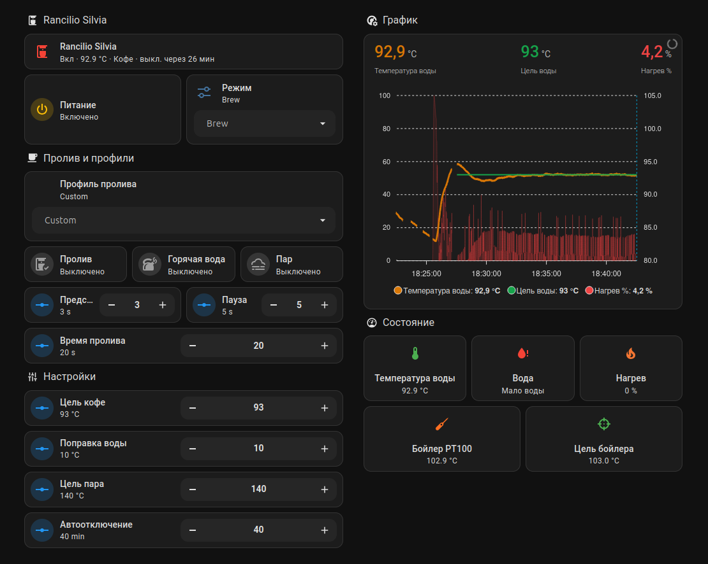

# Rancilio Silvia ESPHome Controller

[English version](README.md)

[Группа проекта в Telegram](https://t.me/Rancilio_Silvia) (русский и английский)

Цифровой контроллер кофемашины Rancilio Silvia на базе ESP32-S3, ESPHome и Home Assistant.

Проект управляет питанием, нагревателем, проливом, горячей водой и режимом пара. Он измеряет температуру бойлера через PT100 + MAX31865, поддерживает отдельные PID-режимы приготовления кофе и пара и отдаёт управление в Home Assistant.

Это не просто очередная PID-модификация. Идея проекта — полностью перевести логику управления кофемашиной на цифровой контроллер: штатная силовая 220В проводка управления убирается с передней панели, высоковольтные нагрузки коммутируются через реле, а штатные кнопки становятся низковольтными GPIO-входами ESP32-S3. Теоретически физические кнопки можно вообще убрать и заменить одним дисплеем или другим цифровым интерфейсом.

> [!WARNING]
> В кофемашине присутствует опасное сетевое напряжение и горячий бойлер под давлением. ESPHome не заменяет штатный термостат, термопредохранитель, заземление и другие аппаратные защиты. Не работайте с подключённой к сети машиной.



https://github.com/user-attachments/assets/92bf4580-1ab9-4535-a1f1-395bb5a3d315

## Возможности

- ESP32-S3 с ESP-IDF
- интеграция с ESPHome и Home Assistant
- PT100 через MAX31865, трёхпроводное подключение
- PID-регулирование нагревателя через SSR
- режимы `Brew` и `Steam`
- регулируемые целевые температуры
- настраиваемая поправка температуры, участвующая в PID-регулировании
- настройка коэффициентов PID и запуск autotune из Home Assistant
- автоматическое сохранение коэффициентов после успешного autotune
- управление штатной кнопкой питания
- полностью цифровое управление питанием, нагревателем, помпой, brew-клапаном, горячей водой и режимом пара
- перевод кнопок передней панели из силового 220В управления в низковольтные GPIO-входы ESP32
- низковольтные входы для кнопок пролива, горячей воды и режима пара
- управление из Home Assistant: пролив, горячая вода, режим пара, реле помпы и brew-клапана
- автоматический таймер пролива
- профили пролива: `Classic`, `Soft Preinfusion`, `Long Preinfusion` и `Custom`
- настраиваемые времена предсмачивания, паузы и основного пролива
- ручное управление реле помпы и brew-клапана
- автоотключение по таймеру неактивности
- сброс таймера автоотключения при проливе, горячей воде, включении пара и ручной активности помпы/клапана
- статусный светодиод
- вход датчика уровня воды
- настраиваемая программная защита от перегрева
- блокировка SSR при недостоверном показании PT100

## Структура

```text
.
├── README.md
├── README.ru.md
├── esphome/
│   ├── rancilio-silvia-power.yaml
│   └── secrets.example.yaml
├── docs/
│   ├── home-assistant.md
│   ├── safety.md
│   └── wiring.md
└── images/
```

## Быстрый старт

1. Установите ESPHome или ESPHome Device Builder в Home Assistant.
2. Скопируйте `esphome/rancilio-silvia-power.yaml` в каталог конфигурации ESPHome.
3. Создайте `secrets.yaml` по примеру `esphome/secrets.example.yaml`.
4. Проверьте назначение GPIO и электрическую схему именно вашей платы.
5. Выполните проверку конфигурации и только после этого соберите прошивку.
6. Первое включение нагревателя проводите под постоянным наблюдением.

## Настройка

Температура приготовления, температура пара, профиль пролива, времена предсмачивания, длительность пролива и время автоотключения настраиваются из Home Assistant. Значения в YAML являются начальными настройками, а не фиксированными характеристиками кофемашины.

### Пролив и профили

`Silvia Brew Shot` запускает автоматическую последовательность пролива:

1. открыть brew-клапан;
2. при необходимости включить помпу для предсмачивания;
3. при необходимости выдержать паузу после предсмачивания;
4. включить помпу на заданное время основного пролива;
5. выключить помпу и закрыть brew-клапан.

`Silvia Brew Profile` даёт три готовых профиля и ручной режим:

- `Classic`: без предсмачивания, пролив 25 с;
- `Soft Preinfusion`: помпа 2 с, пауза 5 с, пролив 25 с;
- `Long Preinfusion`: помпа 3 с, пауза 10 с, пролив 28 с;
- `Custom`: выбирается автоматически, если вручную изменить времена.

`Silvia Hot Water` включает помпу без открытия brew-клапана. `Silvia Steam Mode` переводит PID в паровой режим и возвращает `Brew` при выключении.

### Автоотключение

`Silvia Auto Off Minutes` работает как таймер неактивности. После включения кофемашины начинается отсчёт. Он стартует заново при проливе, горячей воде, включении пара, а также при ручном включении реле помпы или brew-клапана. Значение `0` отключает автоотключение.

### Модель температуры приготовления

`Silvia Brew Target` задаёт желаемую расчётную температуру воды у кофейной таблетки. В режиме `Brew` PID работает по формулам:

```text
Расчётная температура приготовления = температура PT100 - поправка
Цель бойлера = Brew Target + поправка
```

Например, при цели приготовления `93 °C` и поправке `10 °C` расчётная цель бойлера будет примерно `103 °C`.

Сенсор PT100 всегда показывает исходную измеренную температуру бойлера. В режиме `Steam` поправка не применяется, а программная защита от перегрева всегда работает по исходному показанию PT100.

Расчётная температура не является прямым измерением воды. До калибровки у группы при нормальном расходе оставьте поправку равной `0 °C`.

Порог программной защиты задаётся в прошивке. SSR нагревателя работает с периодом `slow_pwm` в одну секунду; после изменения периода может потребоваться повторная настройка PID.

## Текущий статус проекта

Проект находится в активной разработке, но уже полностью работоспособен и используется на реальной кофемашине Rancilio Silvia.

На текущем этапе реализованы:

* измерение температуры бойлера через PT100 и MAX31865;
* PID-регулирование нагревателя через SSR;
* режимы Brew и Steam;
* интеграция с Home Assistant через ESPHome;
* автоматическое отключение;
* контроль уровня воды;
* автоматическая настройка PID (Autotune).

Сейчас система собрана на прототипе с использованием ESP32-S3 и макетного монтажа. В процессе переделки штатная силовая 220В проводка управления снята с кнопок; высоковольтные нагрузки теперь коммутируются через релейные выходы контроллера.

Следующий этап развития проекта — разработка собственной печатной платы (PCB) с разъёмами для подключения датчиков, реле и периферии. Это позволит повысить надёжность, упростить сборку и сделать проект более удобным для повторения другими пользователями.

Продолжаются тестирование, доработка аппаратной части и расширение документации.


## Документация

- [Подключение и GPIO](docs/wiring.md)
- [Home Assistant](docs/home-assistant.md)
- [Безопасность](docs/safety.md)

## Лицензия

Проект пока опубликован без лицензии. Все права сохраняются за автором.
